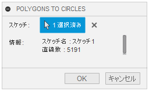

# **_Fusion360 Polygon To Circle_**

This is a Add-in for Autodesk software "Fusion360".

Converts a polygonal sketch line to a circle.

The circle is converted to a circle using the least-squares method based on the polygon's vertices, and the original polygon is converted to a construction.

Sketch lines that are considered transformable are subject to the following conditions.

- It consists of only multiple lines and is closed.
- It exists on the sketch plane (3D sketch elements are excluded).
- It is not a construction element.
- The vertex is within 0.1 mm of the circle calculated from the polygon vertices.

---

### Installation:

Please follow the instructions [here](https://knowledge.autodesk.com/support/fusion-360/troubleshooting/caas/sfdcarticles/sfdcarticles/How-to-install-an-ADD-IN-and-Script-in-Fusion-360.html).

### Usage

1. Start the add-in." Polygons To Circles" will be added to the "Tools" tab, under "Utilities".  
   

1. Click "Polygon To Circle".

1. A dialog box will appear. Select a sketch or a sketch element. When selected, brief information about the sketch will be displayed.

   

1. Press OK to start the process.

- You can process the sketch that has already been used for extrusion, etc., but the profile may not be in the desired state after execution.　 Be sure to check it.
- If the process is interrupted by an error, "Show Profile," "Show Points," "Show Dimensions," and "Show Constraints" in the Sketch Palette may be unchecked.　 Please check them again manually.

### Action:

Confirmed in the following environment.

- Fusion360 Ver2.0.10564
- Windows10 64bit Pro , Home

### License:

MIT

### Acknowledgments:

- Thank you everyone in the [Japanese forum.](https://forums.autodesk.com/t5/fusion-360-ri-ben-yu/bd-p/707)

---

---

以下、日本語です。

これは、オートデスクソフトウェア「Fusion360」のアドインです。

ポリゴン状態となったスケッチ直線を円に変換します。

変換される円はポリゴンの頂点を元に最小二乗法により円に変換され、元のポリゴンはコンストラクションにされます。

＜-直せ

変換可能とされるスケッチ直線は以下の条件です。

- 複数の直線のみで構成され、閉じている。
- スケッチ平面上に存在している（3D スケッチ要素は除外）。
- コンストラクション要素にはなっていない。
- ポリゴン頂点から求められる円から頂点が 0.1mm 以内となっている。

---

### インストール:

インストールする際は、zip ファイルをダウンロード/展開後 "Polygons2Circles" フォルダをアドインとして登録してください。

アドインの登録は、[こちら](https://kantoku.hatenablog.com/entry/2021/02/15/161734)の手順に従ってください。

### 使用法

1. アドインを起動。"ツール" タブの "ユーティリティ" 内に "ポリゴンから円" が追加されます。

   

1. "ポリゴンから円" をクリック。

1. ダイアログが表示されます。スケッチ、又はスケッチ要素を選択して下さい。選択時にはスケッチの簡単な情報が表示されます。

   

1. OK を押すと処理が開始されます。

- 既に押し出し等で使用しているスケッチでも処理は行えますが、実行後はプロファイルが望ましい状態ではない可能性があります。　必ず確認して下さい。
- 万が一にエラーで処理が中断した場合は、スケッチパレットの "プロファイルの表示" "点を表示" "寸法を表示" "拘束を表示" のチェックが外れている可能性があります。　手動にて再度チェックを入れてください。

### アクション:

以下の環境で確認しています。

- Fusion360 Ver2.0.10564
- Windows10 64bit Pro , Home

### ライセンス:

MIT

### 謝辞:

- [日本語フォーラム](https://forums.autodesk.com/t5/fusion-360-ri-ben-yu/bd-p/707)の皆さん、ありがとう。
- 上記の英語で不適切な部分をして頂けると助かります。
